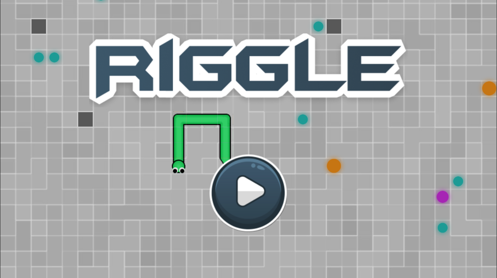
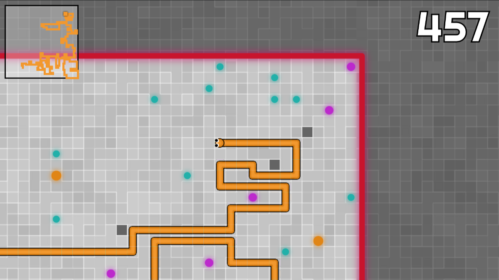
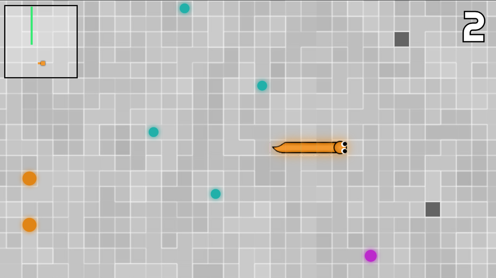

<h1>RIGGLE</h1>

Play the game on [itch.io](https://a-elmahmi.itch.io/riggle)

- Use arrow keys or **WASD** to move your snake around

  

- Collect **Nova Sparks** to grow your snake

  

- Avoid  **Shadow Blocks** and **Laser Walls** to stay alive 

  

- Hold **SPACE** to slither your snake faster

- [Abderrahmane El Mahmi](https://github.com/A-ElMahmi)
- [Abdelrahman Abdalla](https://github.com/boodyy1)
- [Zaid Irfan](https://github.com/zirfan1)
- [Amar Jagana](https://github.com/amarjagana)